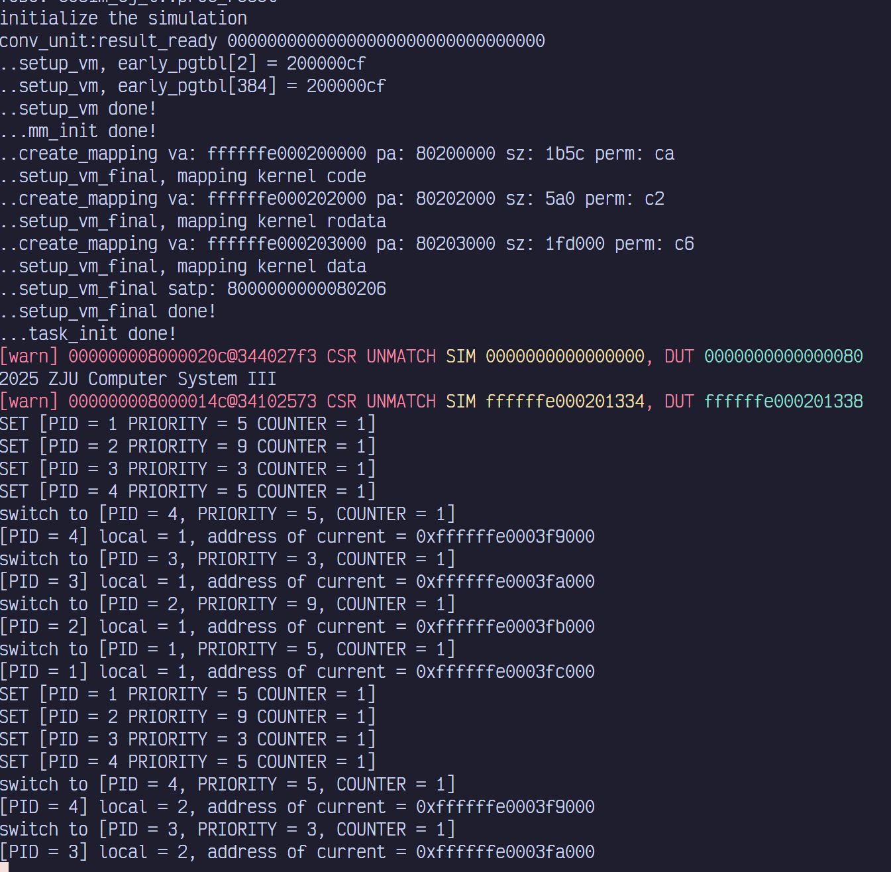
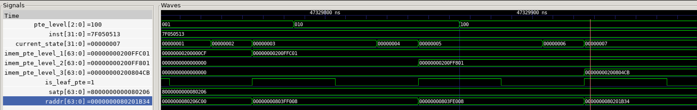
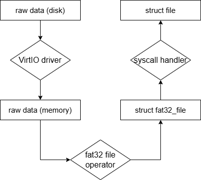

# 2024-2025 计算机系统III Xpart 展示

高玮轩 赵嘉瑞

<!--v-->

## 成果概述

- 硬件：64 位 RISC-V 处理器
    - Forwarding to solve Race Condition (Sys2 lab2)
    - Branch Prediction (Sys3 lab1)
    - MMU (Sys3 lab6)
        - 三级页表
- 软件：OS Kernel (Sys3 lab5)
    - PGF Handlers
    - ELF Loader
    - execve, wait & exit syscall
    - Virtual File System & FAT32
    - RIKESHell
    - C lib function: malloc/free, readline

<!--v-->

## 五级流水线 CPU 运行 kernel 结果

<!--s-->

# Xpart 硬件部分

<!--v-->

## MMU with Branch Prediction

- 未开启 Sv39 虚拟地址
    - 物理地址、握手信号直连，无需改动
- 开启虚拟地址时如果预测错误
    - 不要使用错误的 PC 值遍历页表
    - 等待 PC 恢复后再更新 PC 并继续

<!--s-->

# Xpart 软件部分

<!--v-->

## File System

- 完整实现 QEMU VirtIO 到 FAT32 文件系统再到顶层文件系统抽象
- 基于文件系统实现或完善 open，close，lseek，read，write 系统调用，支持用户读写文件与持久化存储

<!--v-->

## Program Exectuion

- 实现 ELF loading，能从文件系统中读入并加载新程序
- 通过实现 fork，execve，waitpid，exit 系统调用，支持新程序从加载到结束和资源释放的完整流程

<!--v-->

## rike-Shell

- Along with I/O
    - echo

- Along with VFS
    - cat
    - edit
    - run
        - `execve()`
    
- exit

<!--s-->

<h1>感谢聆听，恳请指正</h1>

<h1 style="text-align: center;">Questions?</h1>

